# Bella Italia 


[See live site ](https://bellaitalia-a028d02ecd3c.herokuapp.com)

## Introduction 

Bella Italia is a sophisticated restaurant designed to simplify the restaurant booking experience both for the user and owner. The website contains all the information about the restaurant that you would need and a reservation form 

### Project Overview 

**Bella Italia** is a comprehensive web application designed to simplify the hotel booking experience for users while providing a robust platform for managing reservations. The project leverages modern web technologies and follows best practices in design and user experience to deliver a seamless and engaging interface. Here are the key features and components of the project:

- **User-Friendly Interface**: The clean and intuitive interface uses Google Fonts and Font Awesome icons to enhance readability and navigation. The design prioritizes ease of use, allowing users to find information and make bookings effortlessly.

- **Dynamic Content Management**: Using Django templates, the application supports dynamic content updates, making it easy to maintain and update information about hotel services, rooms, and local attractions.

- **Navigation and Accessibility**: The site includes a clear and accessible navigation bar with links to essential pages like Home, Booking, About Jeri, My Bookings, Login, and Register. This ensures users can easily access the information they need.

### Goals of the project

1. **Simple Booking**: Streamlining the booking process for ease and efficiency.
2. **Enhanced User Experience**: Providing an intuitive interface for seamless navigation and interaction.
3. **Secure Data Handling**: Ensuring the protection of user information and booking details.
4. **Accessibility and Integration**: Making the platform easily accessible and integrating external resources for enhanced functionality.
5. **Optimized Performance**: Delivering fast loading times and smooth interactions for a seamless user experience.

## User Stories

### Completed User Stories

- Install all buildpacks 
- Implement sms confirmation
- Make templates
- Deploy to heroku 
- Implement admin page
- Cancel booked time
- Implement a working booking system
- Make a database 

### Incomplete User Stories
- Change reservation
- Implement messaging system for reservation updates 
- Prevent double booking when restaurant is full

### All user stories
[All Users Stories ](https://github.com/linusapelgren/Bella_Italia/issues)

## Classification of User Stories

User stories in this project were classified into two types: "Could have" and "Must have".

### Could Have
These are non-essential features that are nice to include if time and resources allow. They enhance the project but are not critical to its core functionality.

- Change reservation
- Implement sms confirmation
- Implement messaging system for reservation updates
- Prevent double booking when restaurant is full

### Must Have
These are crucial components necessary for the project's success. They form the foundation and primary functionality that the project cannot do without.

- Install all packs 
- Implement a working booking system
- Cancel booked time
- Set a database 
- Make templates
- Implement admin page
- Deploy to heroku

## Bugs

At this date no Unfixed bugs

### Future Features
- Change reservation
- Implement messaging system for reservation updates 
- Prevent double booking when restaurant is full

## Testing

### Manual testing
I conducted a lot of tests during programming. I used a live preview to check if everything i programmed functioned as intended

### Testing on different screen sizes
I used my browser tools to check how the page looked on different devices

# Wireframes 

## Desktop 

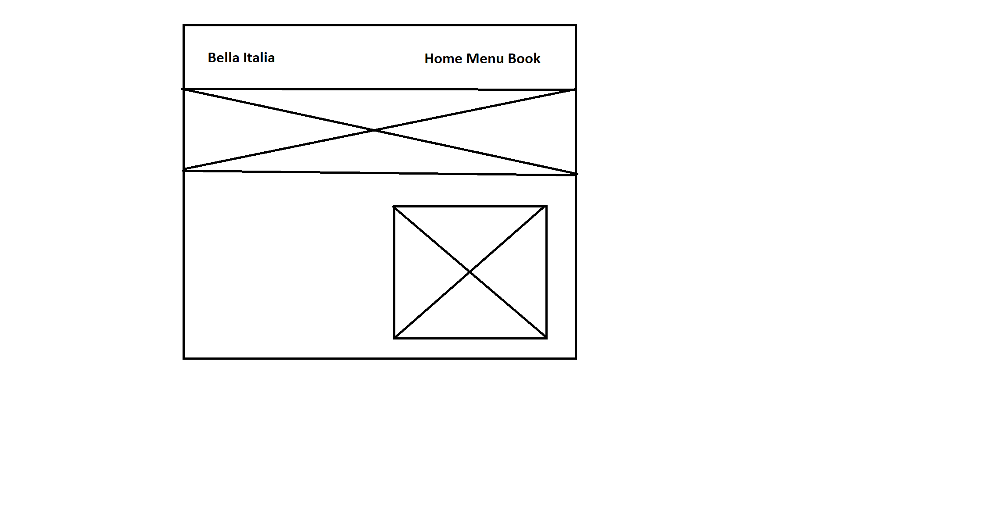

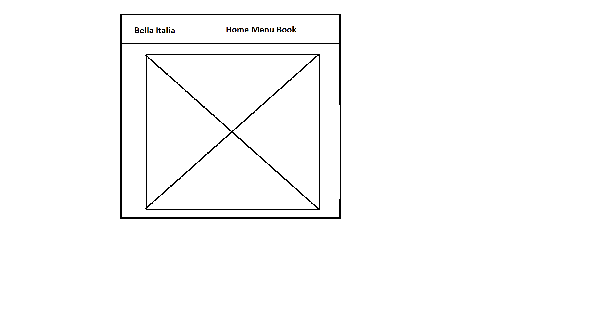

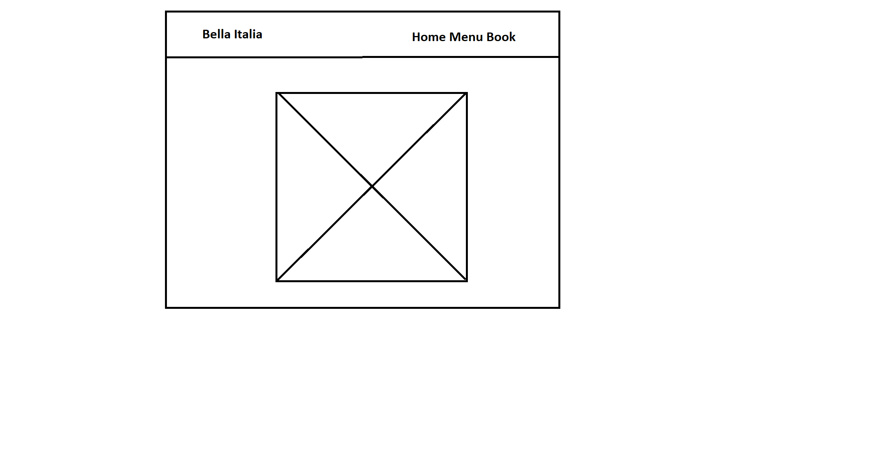

## Mobile Phone 

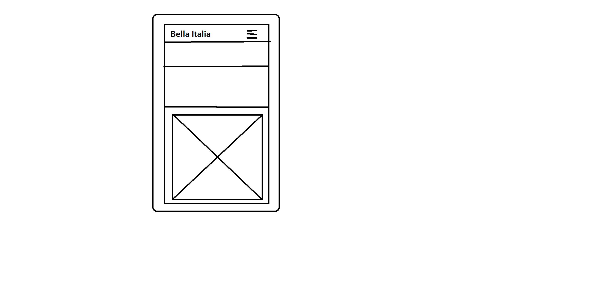

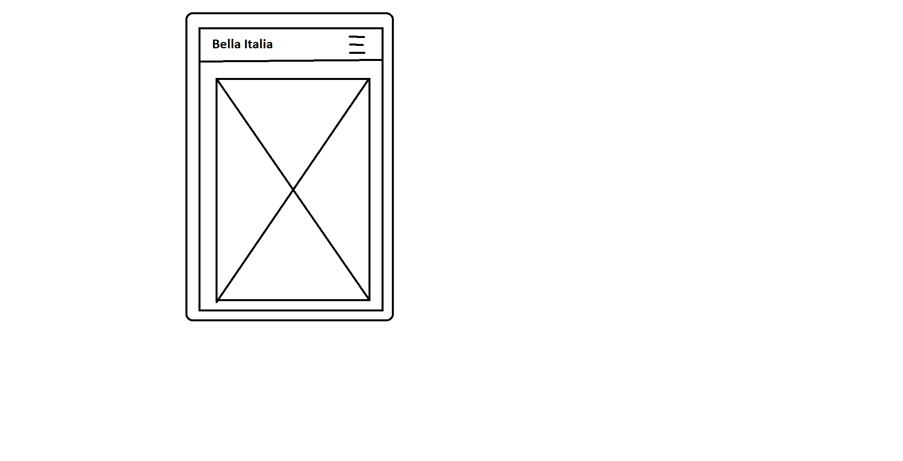

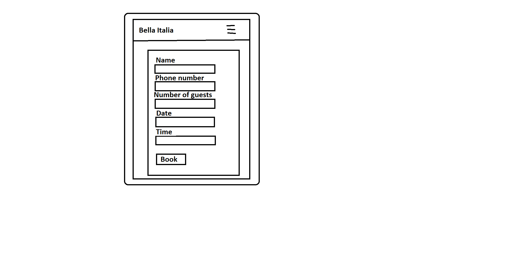

# Features:

Existing Features 

**Navigation**:


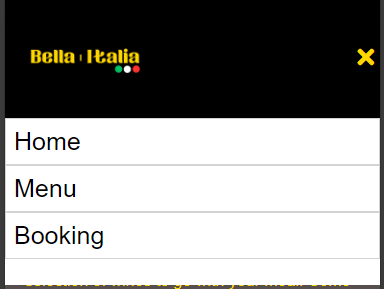

**Booking System**:

***Make reservation***

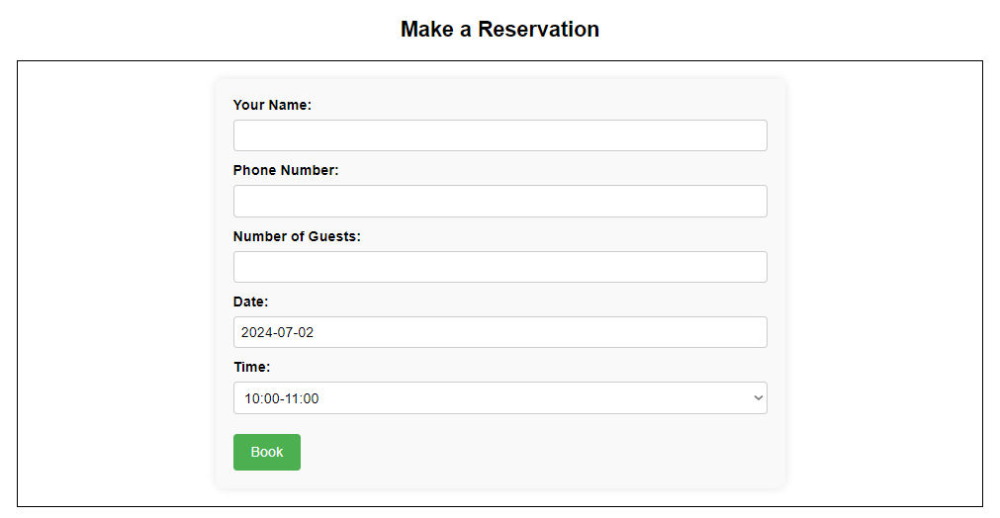

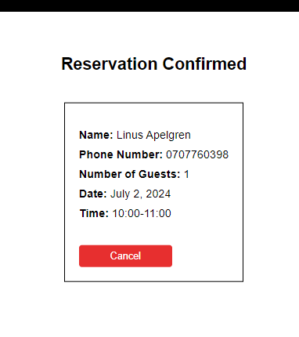

***Reservation form***

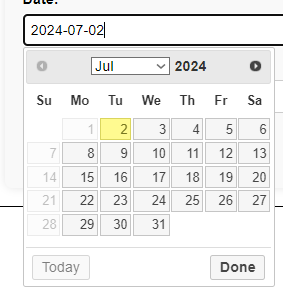

***Cancel reservation***

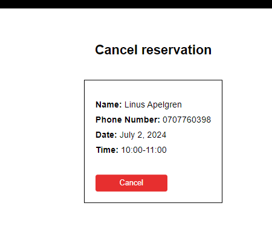


**Menu**:
  
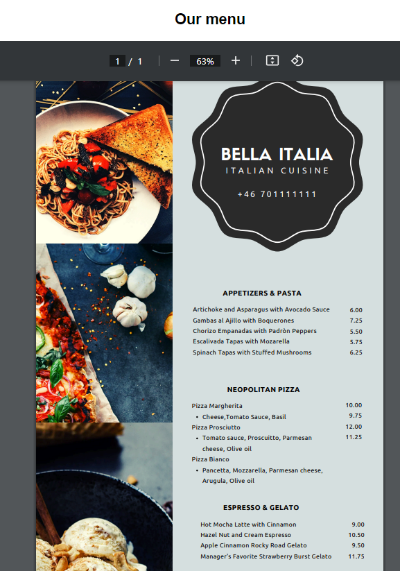

**Admin page**:

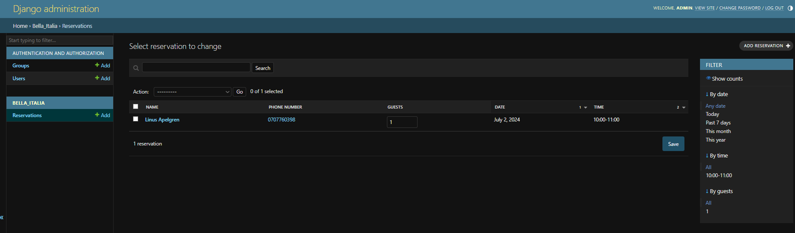


# Technologies Used 

- **HTML**: Used for the main site content.
- **CSS**: Used for the main site design and layout.
- **JavaScript**: Used for user interaction on the site .
- **Python**: Used as the back-end programming language.
- **Git**: Used for version control (git add, git commit, git push).
- **GitHub**: Used for secure online code storage.
- **Gitpod**: Used as a cloud-based IDE for development.
- **Django**: Used as the Python framework for the site.
- **PostgreSQL**: Used as the relational database management.
- **Heroku Postrgres** Add-on for Heroku app
- **Heroku**: Used for hosting the deployed back-end site.
- **Paint**: Used to design my site wireframes.
- **Canva** Used to make assets for my website
 

# Deployment

This website is deployed to Heroku from a GitHub repository. The following steps were taken:

## Creating Repository on GitHub

1. First, make sure you are signed into GitHub and go to the [Code Institute's template](https://github.com/Code-Institute-Org/gitpod-full-template).
2. Then click on "use this template" and select "Create a new repository" from the drop-down. Enter the name for the repository and click "Create repository from template".
3. Once the repository was created, I clicked the green Gitpod button to create a workspace in Gitpod so that I could write the code for the site.

## Creating an app on Heroku

1. After creating the repository on GitHub, head over to [Heroku](https://www.heroku.com/) and sign in.
2. On the home page, click "New" and select "Create new app" from the drop-down.
3. Give the app a name (this must be unique) and select a region. I chose Europe as I am in Europe. Then click "Create app".

## Add heroku postgres to heroku app 

1. On your Heroku dashboard click configure add-ons 
2. Click find more add-ons
3. Scroll down until you find Heroku Postgres
4. Click the Install Heroku Postgres button
5. Choose app to provision the add-on to 
6. Go back to your app dashboard and click settings
7. Click reveal config vars and copy the HEROKU_POSTGRESQL_AMBER_URL and add the value to DATABASE_URL
4. Head over to Gitpod and create a Database URL environment variable in your `.env` file and set it equal to the copied URL.

## Deploying to Heroku

1. Head back over to Heroku and click on your app and then go to the "Settings" tab.
2. On the settings page, scroll down to the "config vars" section and enter the following:
   - `DATABASE_URL`: which you will set equal to the ElephantSQL URL.
   - `Secret key`: this can be anything.
   - `CLOUDINARY_URL`: this will be set to your Cloudinary URL.
   - `Port`: which will be set to 8000.
3. Then scroll to the top and go to the "Deploy" tab and go down to the "Deployment method" section and select GitHub and then sign into your account.
4. Below that in the "search for a repository to connect to" search box enter the name of your repository that you created on GitHub and click connect.
5. Once it has been connected scroll down to the "Manual Deploy" and click "Deploy branch". When it has deployed you will see a "view app" button below and this will bring you to your newly deployed app.
Please note that when deploying manually you will have to deploy after each change you make to your repository.

Heroku needs two additional files in order to deploy properly:
- `requirements.txt`
- `Procfile`

You can install this project's requirements (where applicable) using:


- pip3 install -r requirements.txt

 - If you have your own packages that have been installed, then the requirements file needs to be updated using:
  - pip3 freeze --local > requirements.txt
The Procfile can be created with the following command:
 - echo web: gunicorn app_name.wsgi > Procfile

 Replace `app_name` with the name of your primary Django app; the folder where `settings.py` is located.

For Heroku deployment, follow these steps to connect your own GitHub repository to the newly created app:

- Either:
  - Select Automatic Deployment from the Heroku app.
  - Or:
    In the Terminal/CLI, connect to Heroku using this command:
    ```
    heroku login -i
    ```
  - heroku login -i

  - heroku git:remote -a app_name

After performing the standard Git add, commit, and push to GitHub, you can now type:

- git push heroku main

## Credits

Credits to:
- Microsoft paint for making the wireframes
- Google for some of the images used
- Twilio for sms function
- Canva for some of the assets used on the page


